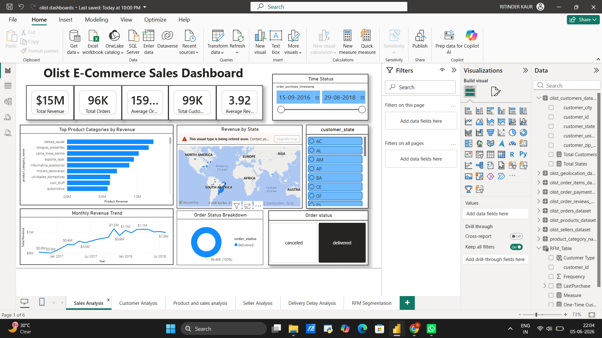
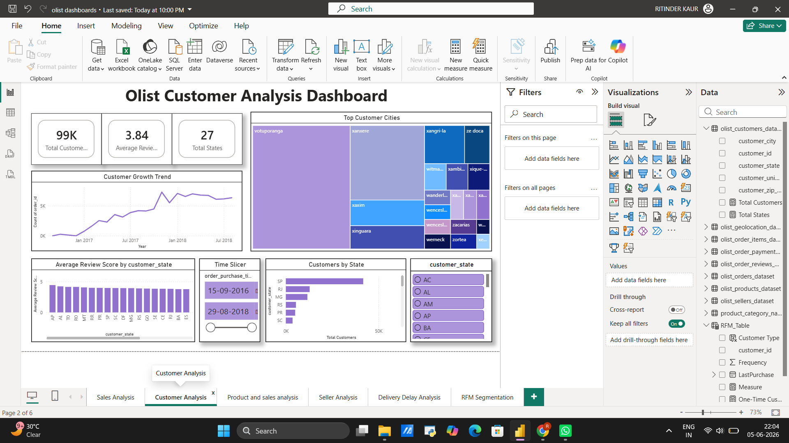
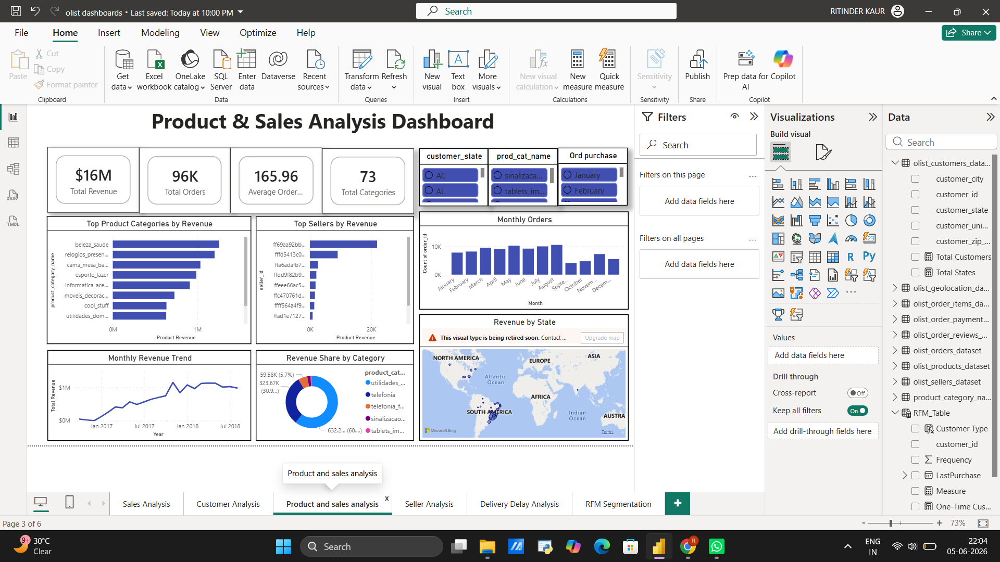
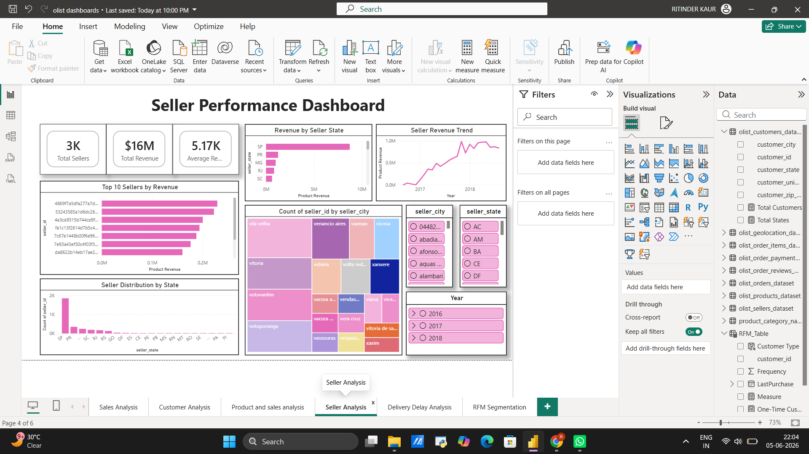
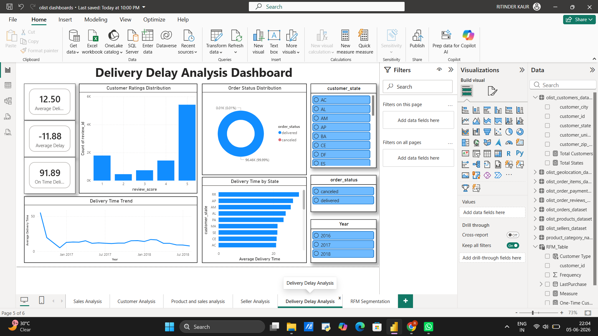
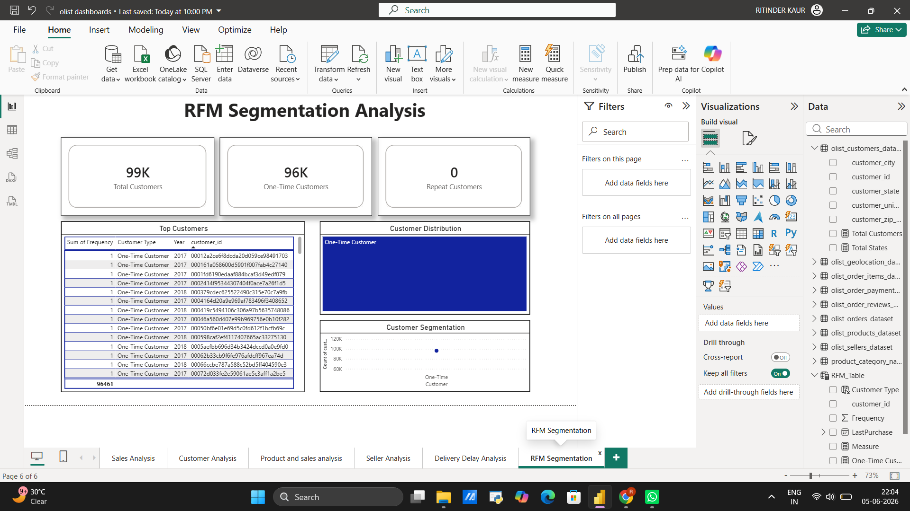

# Olist E-Commerce Power BI Dashboard

An end-to-end business intelligence dashboard built on the [Olist Brazilian E-Commerce dataset](https://www.kaggle.com/datasets/olistbr/brazilian-ecommerce), covering sales performance, customer behavior, logistics, and RFM segmentation.

---

## Dashboard Preview

| Sales Analysis | Customer Analysis |
|---|---|
|  |  |

| Product & Sales | Seller Analysis |
|---|---|
|  |  |

| Delivery Delay Analysis | RFM Segmentation |
|---|---|
|  |  |

---

## Report Pages

| Page | What it covers |
|---|---|
| **Sales Analysis** | KPIs (Revenue, Orders, AOV), category revenue, state-level breakdown, order status |
| **Customer Analysis** | Growth trends, top cities, review scores by state, customer distribution |
| **Product & Sales Analysis** | Top categories and sellers by revenue, monthly order trends |
| **Seller Analysis** | Seller KPIs, revenue trend, geographic distribution |
| **Delivery Delay Analysis** | Delay KPIs, delivery time trends, on-time vs. delayed breakdown |
| **RFM Segmentation** | Recency/Frequency/Monetary segmentation, top customer identification |

---

## Key KPIs Tracked

- Total Revenue & Total Orders
- Average Order Value (AOV)
- Total Customers & Average Review Score
- On-Time Delivery Rate & Average Delay Days
- RFM Segment Distribution

---

## Tools & Tech

- **Power BI Desktop** — report authoring, DAX measures, data modeling
- **DAX** — custom KPIs, time intelligence, RFM scoring logic
- **Power Query (M)** — data cleaning and transformation
- **Dataset** — Olist Brazilian E-Commerce (Kaggle, ~100k orders)

---

## How to Use

1. Clone this repo or download `olist_powerbi_dashboard.pbix`.
2. Open the file in **Power BI Desktop**.
3. If prompted, update the data source path and click **Refresh**.
4. Use the slicers (date range, state, category, order status) to explore the data interactively.

> **Note:** The map visual uses Bing Maps — if you see a retirement warning, replace it with a Filled Map or Azure Maps visual.

---

## Data Source

Olist Brazilian E-Commerce public dataset — [Kaggle link](https://www.kaggle.com/datasets/olistbr/brazilian-ecommerce)

---

## Author

**Ritinder Kaur**

---

## License

MIT
